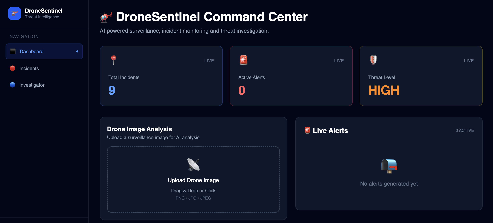
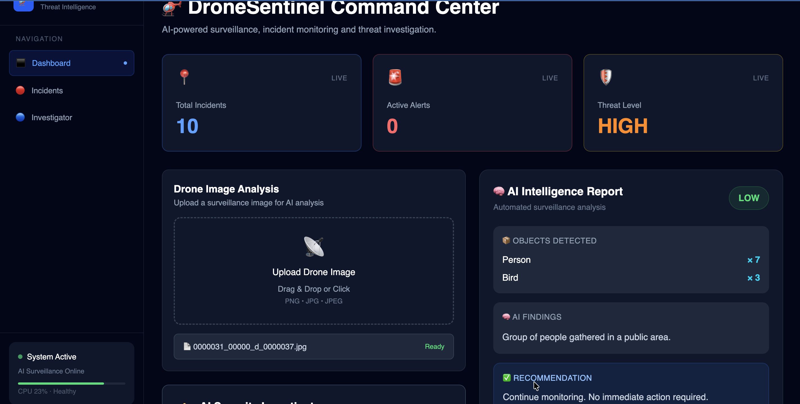
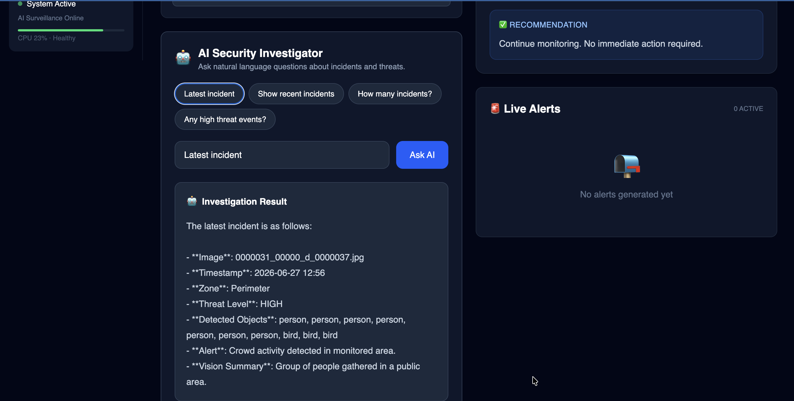
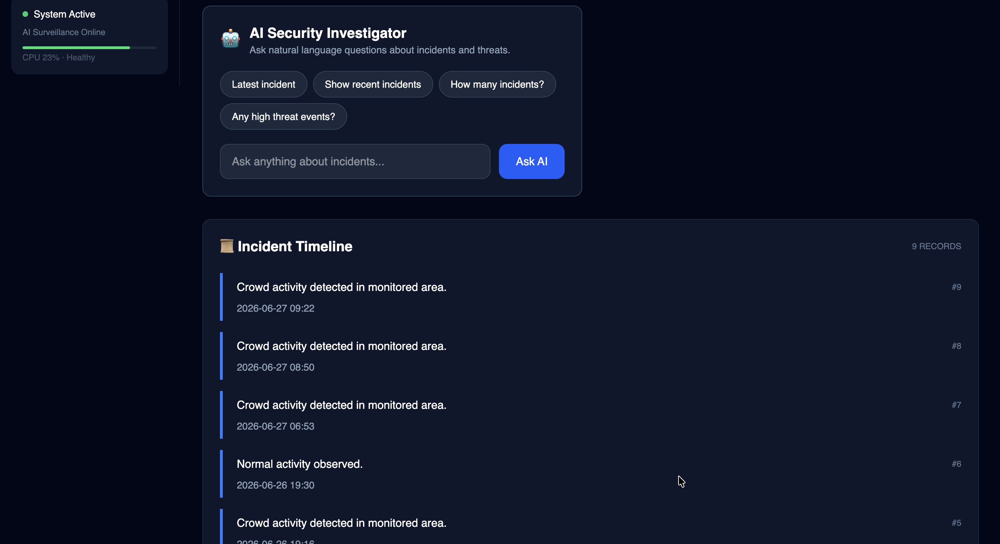
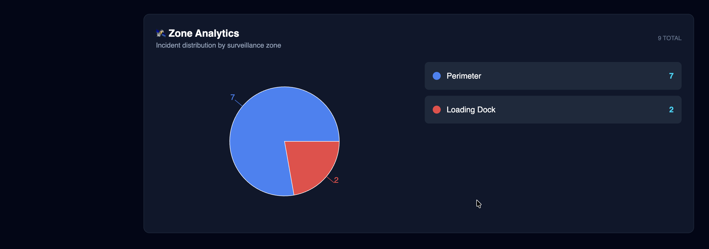
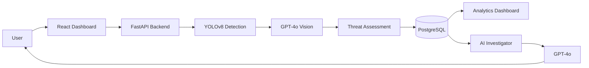
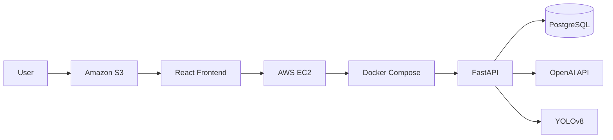
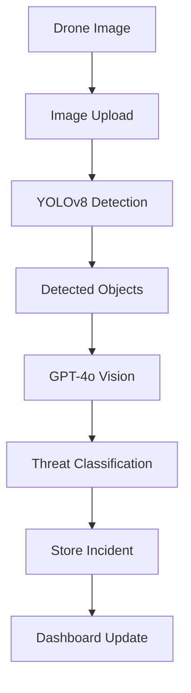
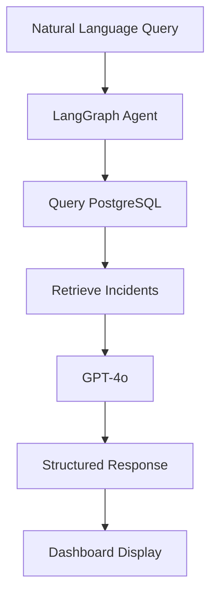
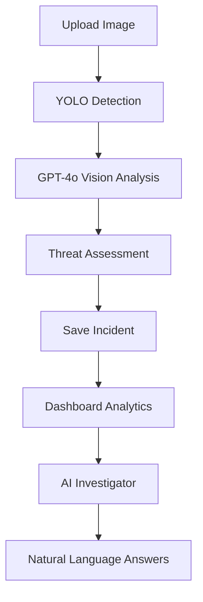

# 🚁 DroneSentinel Agent

**AI-Powered Drone Surveillance & Threat Intelligence Platform**

DroneSentinel Agent is an end-to-end AI surveillance platform that combines Computer Vision, Generative AI, and Cloud Computing to analyze drone surveillance imagery, detect threats, store incidents, generate analytics, and provide an AI-powered investigation assistant.

Built with **YOLOv8** for object detection, **GPT-4o Vision** for scene understanding and visual analysis, **GPT-4o** for natural language investigation workflows, **LangGraph** for agentic AI orchestration, **FastAPI** for backend services, **PostgreSQL** for persistent storage, and **React + TypeScript** for an interactive real-time dashboard — fully containerized with Docker and deployed on AWS.

---

## 🚀 Live Demo

| Service | URL |
|---------|-----|
| Frontend | [http://dronesentinel-agent-ajay.s3-website-ap-south-1.amazonaws.com](http://dronesentinel-agent-ajay.s3-website-ap-south-1.amazonaws.com) |
| Backend API | [http://13.234.78.158:8000/docs](http://13.234.78.158:8000/docs) |

---

## 📸 Screenshots

### Dashboard — Live Monitoring Command Center


### AI Intelligence Report — Real-Time Threat Analysis


### AI Security Investigator — Natural Language Investigation


### Incident Timeline — Historical Activity Log


### Zone Analytics — Incident Distribution by Surveillance Zone


---

## ✨ Features

### 🤖 AI Drone Image Analysis
- Upload drone surveillance images via drag & drop
- YOLOv8 real-time object detection (people, vehicles, aircraft)
- GPT-4o Vision for scene understanding and AI-generated summaries
- Automatic threat assessment — LOW / MEDIUM / HIGH / CRITICAL
- AI-generated intelligence report with recommendations
- Automatic incident and alert storage to PostgreSQL

### 🛡️ Threat Intelligence Dashboard
- Live total incidents, active alerts, and threat level indicators
- Real-time alert feed with severity color coding
- Incident timeline with event descriptions and timestamps
- Zone distribution analytics with pie chart visualization
- Dashboard auto-refreshes after every image upload — no manual refresh needed

### 🤖 AI Security Investigator
Ask natural language questions about surveillance data:
- *Latest incident*
- *Show recent incidents*
- *How many incidents?*
- *Any high threat events?*
- *Which zone has the most activity?*

Powered by **GPT-4o** with direct PostgreSQL access via a LangGraph agentic workflow.

### ☁️ Cloud Deployment
- Frontend on Amazon S3 static website hosting
- Backend on AWS EC2 with Docker Compose orchestration
- PostgreSQL running inside Docker
- Publicly accessible REST API with Swagger documentation

---

## 🏗️ System Architecture



---

## ☁️ AWS Deployment Architecture



---

## 🔄 AI Image Analysis Workflow



---

## 🤖 LangGraph Agentic Investigation Workflow



---

## 📈 End-to-End Application Flow



---

## 🛠️ Technology Stack

| Layer | Technology |
|-------|------------|
| Frontend | React, TypeScript, Vite, TailwindCSS, Recharts |
| Backend | FastAPI, SQLAlchemy, Pydantic, Python |
| Computer Vision | YOLOv8 (Ultralytics) |
| Generative AI | GPT-4o Vision, GPT-4o |
| Agentic AI | LangGraph workflow |
| Database | PostgreSQL |
| Containerization | Docker, Docker Compose |
| Cloud | AWS EC2, Amazon S3 |

---

## 🗄️ Database Schema

### incidents

| Column | Type | Description |
|--------|------|-------------|
| id | Integer | Primary key |
| timestamp | String | Incident datetime |
| event | String | Alert message |
| zone | String | Surveillance zone |
| threat_level | String | LOW / MEDIUM / HIGH / CRITICAL |

### alerts

| Column | Type | Description |
|--------|------|-------------|
| id | Integer | Primary key |
| severity | String | Alert severity level |
| message | String | Alert description |

---

## 📂 Project Structure

```text
DroneSentinel-Agent/
│
├── backend/
│   └── app/
│       ├── api/
│       │   ├── analyze.py
│       │   ├── alerts.py
│       │   ├── incidents.py
│       │   ├── analytics.py
│       │   ├── chat.py
│       │   └── search.py
│       ├── agents/
│       │   ├── nodes.py
│       │   ├── state.py
│       │   ├── workflow.py
│       │   └── investigator.py
│       ├── services/
│       │   ├── vision_service.py
│       │   └── yolo_service.py
│       ├── models.py
│       ├── database.py
│       └── main.py
│
├── frontend/
│   └── src/
│       ├── components/
│       │   ├── StatsCards.tsx
│       │   ├── ImageUpload.tsx
│       │   ├── AnalysisResult.tsx
│       │   ├── AlertFeed.tsx
│       │   ├── IncidentTimeline.tsx
│       │   ├── ZoneAnalytics.tsx
│       │   ├── AIInvestigator.tsx
│       │   └── Sidebar.tsx
│       ├── pages/
│       │   ├── Dashboard.tsx
│       │   ├── Incidents.tsx
│       │   └── Investigator.tsx
│       ├── layouts/
│       └── services/
│           └── api.ts
│
├── screenshots/
├── docker-compose.yml
├── requirements.txt
└── README.md
```

---

## 🚀 Local Installation

**Clone the repository:**
```bash
git clone https://github.com/ajaysathriai-afk/DroneSentinel-Agent.git
cd DroneSentinel-Agent
```

**Add environment variables:**
```bash
cp .env.example .env
# Edit .env and add your OPENAI_API_KEY and DATABASE_URL
```

**Run with Docker:**
```bash
docker compose up --build
```

**Access:**
- Frontend: http://localhost
- Backend API: http://localhost:8000/docs

---

## ✅ Project Status

| Feature | Status |
|---------|--------|
| YOLOv8 Object Detection | ✅ Working |
| GPT-4o Vision Analysis | ✅ Working |
| Threat Assessment | ✅ Working |
| PostgreSQL Persistence | ✅ Working |
| Zone Analytics | ✅ Working |
| AI Security Investigator | ✅ Working |
| Docker Compose | ✅ Working |
| AWS EC2 Deployment | ✅ Working |
| Amazon S3 Frontend | ✅ Working |
| Auto-refresh Dashboard | ✅ Working |

---

## 🔮 Future Enhancements

- Live RTSP drone video streaming
- WebSocket real-time alerts
- Face recognition and license plate detection
- Geofencing with GPS coordinates
- RAG-based knowledge search over incident history
- CloudFront CDN for frontend
- JWT authentication and RBAC
- Email and SMS alerting
- Kubernetes deployment

---

## 🏆 Project Highlights

- End-to-end AI surveillance platform built from scratch
- YOLOv8 computer vision for real-time object detection
- GPT-4o Vision for scene understanding and threat classification
- LangGraph agentic workflow for AI investigation
- Natural language investigation assistant powered by GPT-4o
- Auto-refreshing React dashboard — updates after every image analysis
- Zone and threat-level tracking with PostgreSQL
- RESTful FastAPI backend with modular router architecture
- Dockerized deployment on AWS EC2 with Amazon S3 frontend hosting

---

## 👨‍💻 Author

**Ajay Kumar Sathri**

MS in Computer Science — University of North Texas

AI Engineer · Generative AI · Computer Vision · Full-Stack · Cloud

GitHub: [github.com/ajaysathriai-afk](https://github.com/ajaysathriai-afk)
