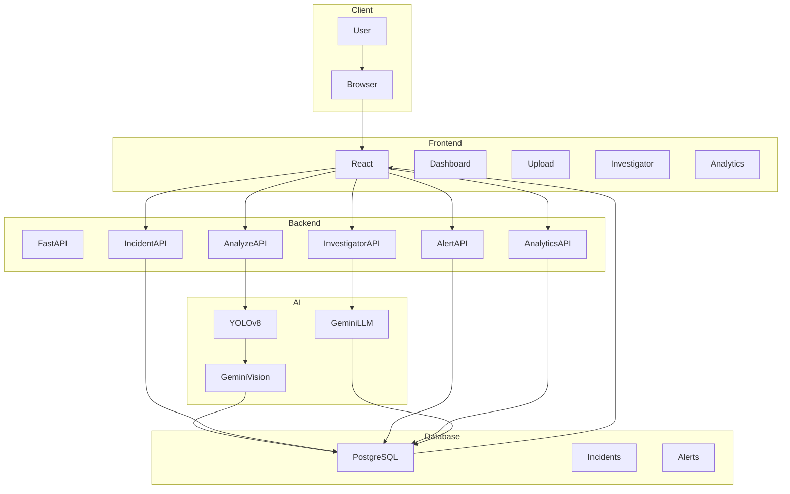
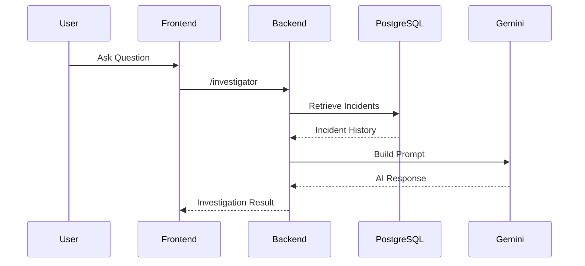

# 🚁 DroneSentinel Agent

> **AI-Powered Drone Surveillance & Threat Intelligence Platform**

DroneSentinel Agent is an end-to-end AI surveillance platform that combines **Computer Vision**, **Generative AI**, and **Cloud Computing** to analyze drone surveillance imagery, detect threats, store incidents, generate analytics, and provide an AI-powered investigation assistant.

The platform leverages **YOLOv8** for object detection, **Google Gemini Vision** for scene understanding, **FastAPI** for backend services, **PostgreSQL** for persistent storage, and **React + TypeScript** for an interactive dashboard. The application is fully containerized using Docker and deployed on AWS.

---

# 🚀 Live Demo

### Frontend

```
http://dronesentinel-agent-ajay.s3-website-ap-south-1.amazonaws.com
```

### Backend API

```
http://13.234.78.158:8000/docs
```

---

# ✨ Features

## 🤖 AI Drone Image Analysis

* Upload drone surveillance images
* YOLOv8 object detection
* AI-powered scene understanding
* Automatic threat assessment
* Incident storage
* AI-generated surveillance summary

---

## 🛡 Threat Intelligence Dashboard

* Total Incidents
* Active Alerts
* Threat Level
* AI Status
* Incident Timeline
* Zone Analytics

---

## 🤖 AI Security Investigator

Ask natural language questions such as:

* Latest incident
* Show recent incidents
* How many incidents?
* Any high threat events?
* Zone specific questions

Powered by Google Gemini.

---

## 📊 Incident Analytics

* Historical incident timeline
* Zone distribution
* Threat statistics
* Incident summaries

---

## ☁ Cloud Deployment

* Amazon S3 Static Website Hosting
* AWS EC2
* Docker
* PostgreSQL

---

# 🛠 Technology Stack

## Frontend

* React
* TypeScript
* Vite
* TailwindCSS
* Recharts

## Backend

* FastAPI
* SQLAlchemy
* PostgreSQL
* Pydantic

## AI

* YOLOv8
* Google Gemini Vision
* Gemini LLM

## Cloud

* AWS EC2
* Amazon S3
* Docker
* Docker Compose

---

# 🏗 System Architecture

```mermaid
flowchart LR

User

-->

React Dashboard

-->

FastAPI Backend

-->

YOLOv8 Object Detection

-->

Gemini Vision

-->

Threat Assessment

-->

PostgreSQL

-->

Analytics Dashboard

PostgreSQL

-->

AI Investigator

AI Investigator

-->

Gemini LLM

Gemini LLM

-->

User
```

---

# 🏛 Production Architecture



---

# 🔄 AI Image Analysis Workflow

```mermaid
flowchart LR

DroneImage

-->

Image Upload

-->

YOLOv8 Detection

-->

Detected Objects

-->

Gemini Vision

-->

Threat Classification

-->

Store Incident

-->

Dashboard
```

---

# 🤖 AI Investigation Workflow



---

# 📂 Project Structure

```
DroneSentinel-Agent

├── backend
│
│   ├── app
│   │
│   ├── api
│   ├── models.py
│   ├── database.py
│   ├── investigator.py
│   ├── main.py
│   └── services
│
├── frontend
│
│   ├── src
│   │
│   ├── components
│   ├── pages
│   ├── layouts
│   ├── services
│   └── hooks
│
├── docker-compose.yml
├── Dockerfile
├── README.md
└── requirements.txt
```

---

# 📈 Application Workflow

```mermaid
graph TD

Upload Image

-->

YOLO Detection

-->

Gemini Analysis

-->

Threat Assessment

-->

Save Incident

-->

Dashboard Analytics

-->

AI Investigator

-->

Natural Language Answers
```

---

# ☁ AWS Deployment Architecture

```mermaid
flowchart LR

User

-->

Amazon S3 Static Website

-->

React Frontend

-->

AWS EC2

-->

Docker Compose

-->

FastAPI

-->

PostgreSQL

FastAPI

-->

Gemini API

FastAPI

-->

YOLOv8
```

---

# 🗄 Database

## incidents

| Column       | Type     |
| ------------ | -------- |
| id           | Integer  |
| timestamp    | DateTime |
| event        | String   |
| zone         | String   |
| threat_level | String   |
| ai_summary   | Text     |

---

## alerts

| Column    | Type     |
| --------- | -------- |
| id        | Integer  |
| title     | String   |
| severity  | String   |
| timestamp | DateTime |

---

# 🚀 Installation

Clone the repository

```bash
git clone https://github.com/<YOUR_USERNAME>/DroneSentinel-Agent.git
cd DroneSentinel-Agent
```

Run using Docker

```bash
docker compose up --build
```

Frontend

```
http://localhost
```

Backend API

```
http://localhost:8000/docs
```

---

# 📸 Screenshots

* Dashboard
* Drone Image Analysis
* AI Security Investigator
* Incident Timeline
* Zone Analytics
* Threat Dashboard

---

# 🔮 Future Enhancements

* Live RTSP Drone Video Streaming
* Multi-Camera Monitoring
* WebSocket Live Alerts
* Face Recognition
* License Plate Recognition
* Geofencing
* LangGraph Multi-Agent Workflow
* RAG-based Knowledge Search
* CloudFront CDN
* JWT Authentication
* RBAC
* Email & SMS Alerting
* Kubernetes Deployment

---

# 🏆 Project Highlights

* End-to-End AI Surveillance Platform
* YOLOv8 Computer Vision
* Google Gemini Vision Integration
* AI-Powered Threat Assessment
* Natural Language Investigation Assistant
* Interactive React Dashboard
* PostgreSQL Analytics
* RESTful FastAPI Backend
* Dockerized Deployment
* AWS EC2 + Amazon S3 Hosting

---

# 👨‍💻 Author

**Ajay Kumar Sathri**

MS in Computer Science – University of North Texas

**AI • Generative AI • Computer Vision • Full-Stack Development • Cloud Computing**
